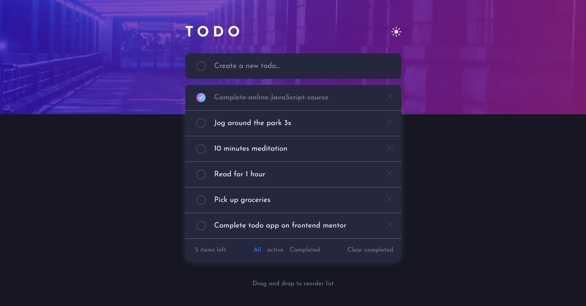

# Frontend Mentor - Todo app

## Welcome! 👋

# Frontend Mentor - Todo app solution

This is a solution to the [Todo app challenge on Frontend Mentor](https://www.frontendmentor.io/challenges/todo-app-Su1_KokOW).

### Screenshot

### Links

- Live Site URL: (https://karimaoulallay.github.io/Todo-App/)

## My process

### Built with

- Object Oriented Programming method
- Semantic HTML5 markup
- CSS custom properties
- Flexbox
- Normalize css file
- Local storage
- Night and light mode
- Sortable tasks list

### What I learned

I learnt on this project oop and sortable list.

### Useful resources

- (https://www.youtube.com/watch?v=wv7pvH1O5Ho&t=2072s) - This video by the amazing Travery media channel on Youtube helped me for understanding of sortable lists.
- (https://www.youtube.com/watch?v=JaMCxVWtW58&t=1700s) - also another video from Travery media that helped about oop oop method.

## Author

- Frontend Mentor - (https://www.frontendmentor.io/profile/karimode)
- Twitter - (https://twitter.com/karim_aoulallay)
